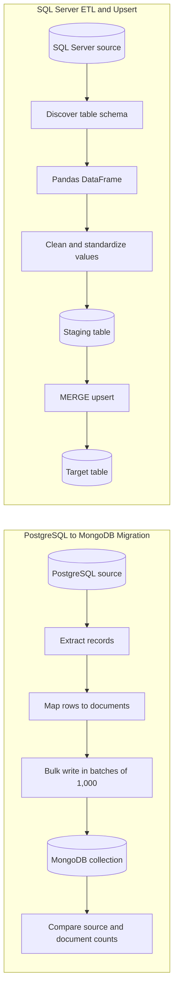

# Python ETL Pipelines | Data Engineering Portfolio

[](https://www.python.org/)
[](https://www.postgresql.org/)
[](https://www.mongodb.com/)
[](https://www.microsoft.com/sql-server)
[](https://pandas.pydata.org/)

This repository is a hands-on data engineering portfolio project demonstrating two reusable database-pipeline patterns: migrating relational records into a document store and cleaning then upserting SQL Server data. It is built around practical concerns in operational ETL work: configuration isolation, schema discovery, batch ingestion, transformation with Pandas, and basic load validation.

---

## Portfolio Snapshot

| Area | Demonstrated capability |
| --- | --- |
| Data extraction | Read tabular records from PostgreSQL and SQL Server |
| Transformation | Build and clean Pandas DataFrames before loading |
| Database migration | Convert PostgreSQL rows into MongoDB documents |
| Efficient loading | Write MongoDB documents in batches of 1,000 operations |
| Data synchronization | Use SQL Server `MERGE` for insert-or-update behavior |
| Secure configuration | Load connection settings from environment variables with `python-dotenv` |

---

## Pipeline Architecture



---

## Case Study 1: PostgreSQL to MongoDB Migration

**Script:** [`src/pg_to_mongo_migration.py`](src/pg_to_mongo_migration.py)

This pipeline extracts records from a PostgreSQL table and reshapes each row into a MongoDB document. For larger datasets, it collects `InsertOne` operations and commits them with `bulk_write` every 1,000 records to reduce per-row network overhead. Once the load finishes, it compares the source row count against MongoDB's document count as a lightweight completeness check.

**Document mapping**

```text
PostgreSQL row
  user_id | ranking | sku_code | create_info_timestamp
                         ↓
MongoDB document
  { user_id, ranking, sku_code, create_info_timestamp }
```

**Engineering decisions**

- Connection details are read from `.env`, keeping credentials out of source control.
- The MongoDB URI supports both standalone deployments and replica sets.
- The destination collection is recreated before a full-refresh load.
- Timestamps are normalized to a consistent string format before insertion.

> Note: This script currently implements a full refresh, so the target collection is dropped and recreated on each run. Use it only when that loading behavior matches the destination's requirements.

---

## Case Study 2: SQL Server ETL and Upsert

**Script:** [`src/sqlserver_etl_upsert.py`](src/sqlserver_etl_upsert.py)

This workflow extracts a SQL Server table, retrieves its column names dynamically from `INFORMATION_SCHEMA.COLUMNS`, and creates a Pandas DataFrame for transformation. It replaces two working tables and then uses a SQL Server `MERGE` statement to synchronize the target table: matching keys are updated and new keys are inserted.

**Transformation and load flow**

```text
SQL Server source table
  -> schema lookup
  -> Pandas DataFrame
  -> row/value cleanup
  -> staging export
  -> MERGE into target table
```

**Engineering decisions**

- Dynamic schema lookup avoids manually duplicating source column names in the pipeline.
- Pandas provides an explicit, inspectable transformation layer before loading.
- SQLAlchemy manages table exports, while `pyodbc` runs the SQL Server `MERGE` operation.
- The current `main()` replaces both working SQL tables with `to_sql(if_exists="replace")` before calling `MERGE`. It demonstrates the SQL pattern, but must be adapted to preserve an existing target for incremental synchronization.

---

## Technology Stack

- **Language:** Python 3.10+
- **Databases:** PostgreSQL, MongoDB, Microsoft SQL Server
- **Data processing:** Pandas
- **Connectors:** `psycopg2`, `pymongo`, `pyodbc`, SQLAlchemy
- **Configuration:** `python-dotenv`

---

## Repository Structure

```text
python-etl-pipelines/
├── src/
│   ├── pg_to_mongo_migration.py    # PostgreSQL extraction and MongoDB bulk migration
│   └── sqlserver_etl_upsert.py     # SQL Server transform, staging load, and MERGE upsert
├── .env.example                    # Required connection-variable template
├── requirements.txt                # Python dependencies
└── README.md
```

---

## Run Locally

### 1. Clone and install dependencies

Use Python 3.10+ for this setup and install the pinned dependencies below. The SQL Server script also requires the system-level **ODBC Driver 17 for SQL Server** referenced in its connection string.

```bash
git clone https://github.com/Panutle/python-etl-pipelines.git
cd python-etl-pipelines
```

Create a virtual environment:

```bash
python -m venv .venv
```

**Windows PowerShell**

```powershell
.\.venv\Scripts\Activate.ps1
python -m pip install -r requirements.txt
```

**macOS / Linux**

```bash
source .venv/bin/activate
python -m pip install -r requirements.txt
```

### 2. Configure database connections

Copy `.env.example` to `.env`, then update the database hosts, usernames, passwords, and database names for your environment.

```powershell
Copy-Item .env.example .env
```

Do not commit `.env`; it contains credentials. This repository does not currently include a `.gitignore`, so add `.env` and `.venv/` to your local Git exclusions before staging files.

### 3. Set the table-specific values

Before execution, replace the placeholder table names and transformation logic in the relevant script:

- In `pg_to_mongo_migration.py`, update `source_table_name` in the query and align the row-to-document mapping with the source schema.
- In `sqlserver_etl_upsert.py`, update `table_target`, `table_upsert`, `table_source`, `col_condition`, and the logic in `DF_2()` for the actual dataset.

### 4. Execute a pipeline

Choose one script for your configured test databases. The MongoDB script drops the destination collection; the SQL Server script replaces both configured working tables. Neither command is a read-only preview.

```bash
python src/pg_to_mongo_migration.py
python src/sqlserver_etl_upsert.py
```

---

## What This Project Shows

This project reflects an ability to move data between heterogeneous database systems, build clear transformation steps, and design loading logic around real database behavior. It is intentionally kept as small, readable scripts so that the migration and upsert patterns can be inspected, adapted, and extended for production data workflows.
